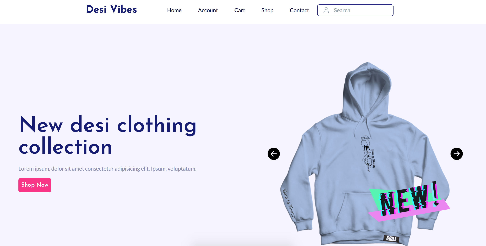
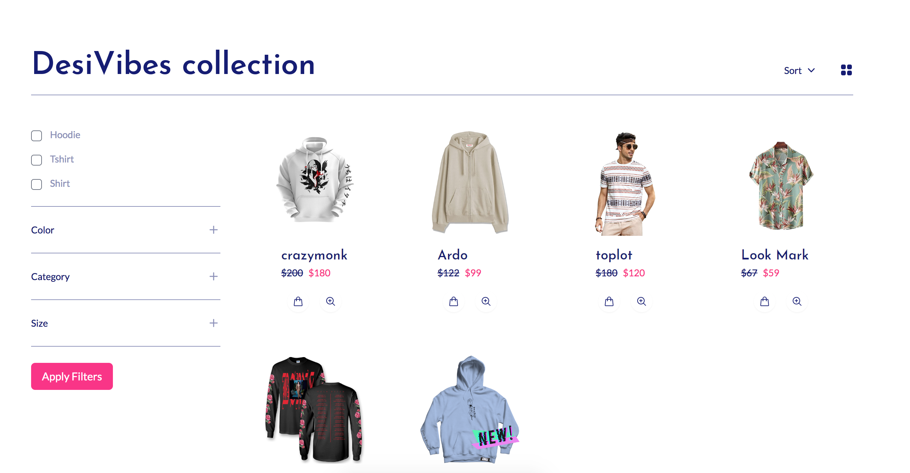

# Desivibes

A single page web React app which uses [Firebase](https://firebase.google.com/) for authentication, hosting and as a storage database. It also uses [React Hook Form](https://react-hook-form.com/api/useform/) for form validation and [Paypal](https://developer.paypal.com/home) as a payment gateway.

You can search for products like tshirts, hoodies and sweatshirts.
Add them to the cart.
Buy them.

Docker compose is used to start react app(node-16) and Keycloak. Once its running you
now can experiment with the React code and learn about Keycloak
features using its administration UI.

## Live app

The live app is running at [DesiVibes](https://desivibes-a02a5.web.app/)

# Running Locally

To run the React app built from this repository, you will need to run npm i && npm run build && npm run preview
